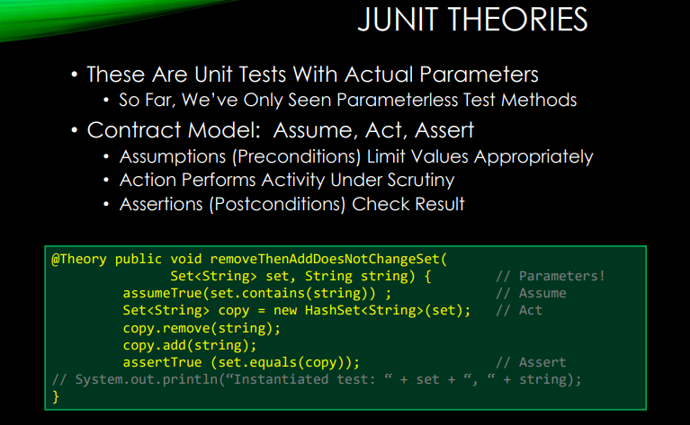

# CS304 Review

## Lec01

​	Software processes:


## Lec02

​		


### 		SVN: Apache Subversion

​			Create local copy: `svn checkout <address_to_remote> <name_of_local_dir>` `git checkout <branch_name>`

​			Commit local changes: `svn commit -m "msg"` `git commit -m "msg"`

​			Update local copy: `svn up` `git pull upstream master`

​			Telling svn/git about a new file to track: `svn add <file-name>` `git add <file-name>`

​			More commands:

​			


​				Git: Distributed, checksum(first 7 chars). Modify->Stage->Commit

  

​				Building tool: make, ant, mvn, Gradle, ...

									


​		

## Lec03


​			


## Lec04





## Lec05

​		Each test should be independent of each other

​		Any given behavior should be specified in one and only one test.

​		`assertEquals(expected, actual)`


​			Code coverage:


Jacoco:`java -jar- -javaagent:/jacocoagent.jar=destfile=/jacoco.exec`

EvoSuite: EvoSuite uses evolutionary algorithm to generate and optimize whole test suites towards satisfying a coverage criterion.


## Lec06

​	


## Lec07


Reverse Engineering


## Lec09


### Testing: 

- Dynamic analysis(Astor, PraPR)

- static analysis(no dynamic execution, detect possible defects in an early stage). 

  - Checkstyle: focus on java coding style and standards.

  - PMD: scan source code and looks for potential problems

    

  - Findbugs  

  - Defensive Programming: no warning by Static Analysis


## Lec10

​	Tools check for coding standard: PIT, CheckStyle, FindBugs, PMD


```java
/**
* This is where the text starts. The asterisk lines 
* up with the first asterisk above; there is a space 
* after each asterisk. The first sentence is the most 
* important: it becomes the “summary.” 
*
* @param x Describe the first parameter (don’t say its type). 
* @param y Describe the first parameter (don’t say its type). 
* @return Tell what value is being returned (don’t say its type). 
*/ 
public String myMethod(int x, int y) { // p lines up with the / in /**

/*
@auther 
@version
*/
    //TODO //FIXME //XXX
```


## Lec11


## Lec12


## Lec13


CI Server:

 


Big-Bang Integration Testing, Incremental Integration Testing, Top-Down Integration, Bottom-Up Integration, "Sandwich" Integration


## Lec14


## Appendix

Extreme Programming(XP)		

Software configuration management (SCM) 

Version Control System(VCS)

Test Driven Development(TDD)

Weighted Methods Per Class (WMC)

Depth of Inheritance Tree (DIT) 

Number of Children (NOC)

Coupling between Object Classes (CBO)

Response for a Class (RFC)

Lack of Cohesion in Methods (LCOM)

Component-Based Software Engineering(CBSE)

Commercial Off-the-Shelf Software (COTS) 

Experience Improvement Program (CEIP) 

Continuous Integration(CI)

Continuous Delivery(CD)

Regression Test Selection(RTS)

Automated Program Repair (APR)
